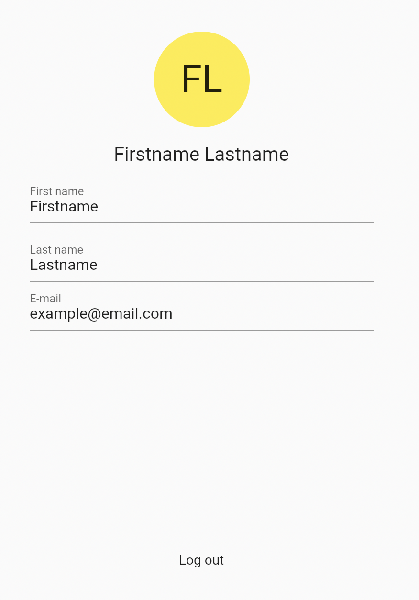

# Flutter Profile

Flutter Profile is a package you can use to display any user data and let them alter it if desired.

## Features

Display every type of user data.
Display an image/avatar.
Enable the user to alter his data or withhold the user from doing so.

## Setup

To use this package, add `flutter_profile` as a [dependency in your pubspec.yaml file](https://flutter.dev/docs/development/platform-integration/platform-channels).

## How To Use

See the [Example Code](example/lib/main.dart) for an example on how to use this package.

Underneath are all paramters, of the 'ProfilePage' widget, listed with an explanation.

| Parameter          | Explaination                                                                                                                                          |
| ------------------ | ----------------------------------------------------------------------------------------------------------------------------------------------------- |
| user               | The class that contains all the user data.                                                                                                            |
| service            | The service which determines what happens the user wants to update their profile, update their avatar or press the InkWell at the bottom of the page. |
| style              | With the use of ProfileStyle a couple of style options can be set for the form.                                                                       |
| customAvatar       | An option to override the standard avatar.                                                                                                            |
| showAvatar         | The ability to disable/enable the avatar.                                                                                                             |
| itemBuilder        | The way to override the standard textfield for each standard piece of user data.                                                                      |
| itemBuilderOptions | The options used by the standard itemBuilder to alter the function and style of the textfields                                                        |

## Issues

Please file any issues, bugs or feature request as an issue on our [GitHub](https://github.com/Iconica-Development/flutter_profile/pulls) page. Commercial support is available if you need help with integration with your app or services. You can contact us at [support@iconica.nl](mailto:support@iconica.nl).

## Want to contribute

If you would like to contribute to the plugin (e.g. by improving the documentation, solving a bug or adding a cool new feature), please carefully review our [contribution guide](../CONTRIBUTING.md) and send us your [pull request](URL TO PULL REQUEST TAB IN REPO).

## Author

This `flutter-image-picker` for Flutter is developed by [Iconica](https://iconica.nl). You can contact us at <support@iconica.nl>
